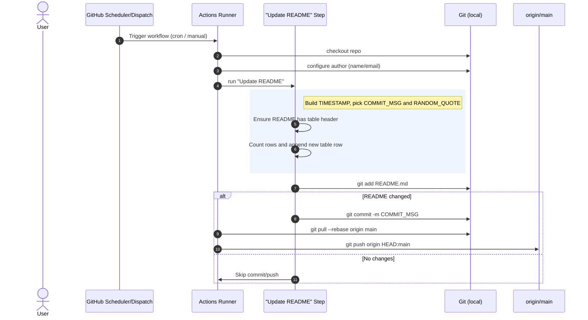

  

<h1 align="center">🔥 <strong>GitHub Streak Maintainer Pro+</strong> 🔥</h1>

<em>Keep your streak alive, even while you sleep!</em>

---

  
  
  
  

---

## 
📜 <strong>About This Project</strong>

🔥 <strong>Automate your GitHub streak like a pro!</strong>  
This project ensures your GitHub contributions never stop. It updates your <code>README.md</code> automatically multiple times a day with cool entries, random quotes, and stylish logs. 

---

## Sequence Diagram(s)

## 
🔥 <strong>Key Features</strong> 🔥

- ✅ **Fully Automated** – No manual commits needed.
- ✅ **Random Quotes + Emojis** – Looks natural, fun & engaging.
- ✅ **Beautiful Commit History Table** – Grows every update.
- ✅ **Multiple Daily Commits** – Stay super active.
- ✅ **Works with GitHub Actions** – 100% free automation.

---

## 
🚀 <strong>Quick Start</strong>

###  1. Fork This Repo  

###  2. Edit Workflow File  
Go to:

    .github/workflows/streak.yml

Replace:
- `user.email` → Your GitHub **noreply email**
- `user.name` → Your **GitHub username**

###  3. Save & Run Workflow  
`- Commit changes`  
`- Go to **Actions tab** → Run Workflow manually (or wait for schedule)`
    
---

## 
🌍 <strong> Deployment </strong>

No external server required.

Just upload files → GitHub Actions will handle everything.

---

## 
📝 <strong>Changelog</strong>

Click to Expand
v1.0 → Initial release with README auto-update feature.

v1.1 → Added random quotes + multiple commits daily.

v2.0 → Pro Design + Commit History Table + Stylish UI.

---

  
  
  

---

## 🚀 GitHub Streak Tracke (Pro+)

---

## 📅 Commit History
| # | Date & Time (UTC) | Message | Quote |
|---|--------------------|---------|-------|

| -1 | 2025-09-02 19:38:07 | Random change 🏞️ | 🔥 Keep the flame alive |
| 0 | 2025-09-02 23:26:17 | Small tweak 🌳 | 🕯️ Light in the darkness |
| 1 | 2025-09-03 05:33:13 | Random change 🏞️ | ⚡ Power never dies |
